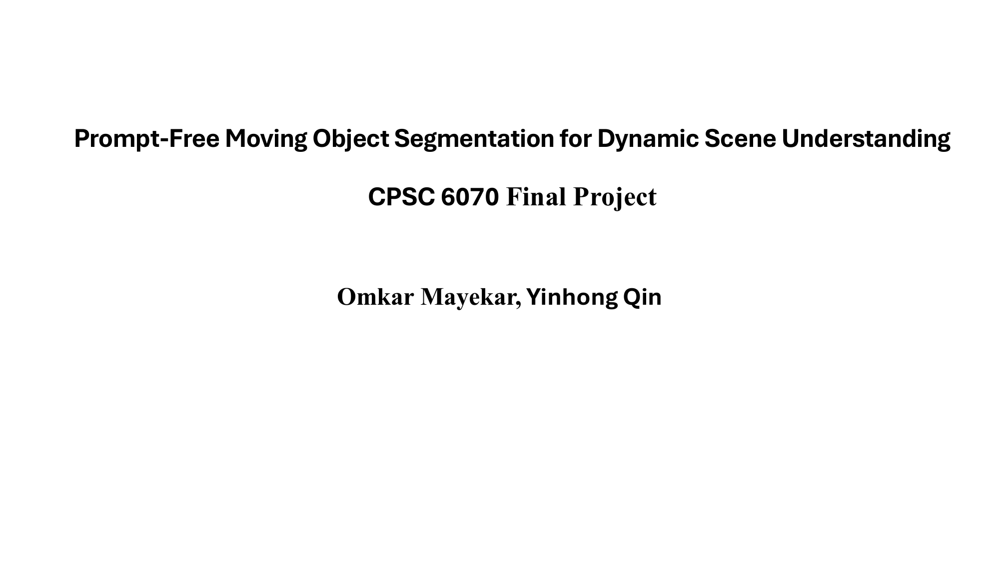
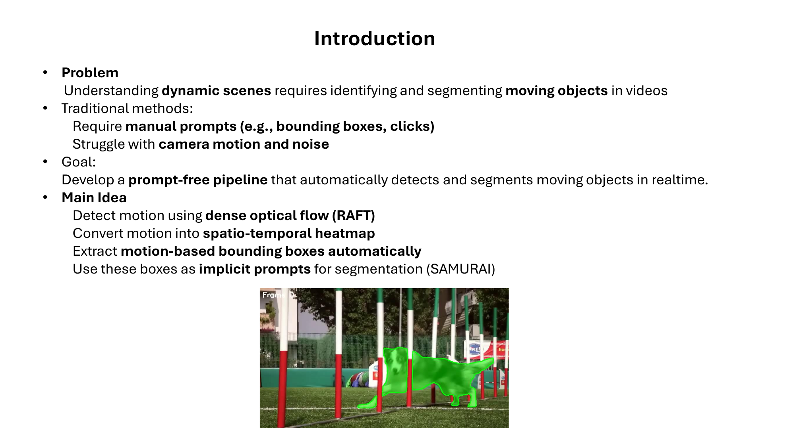
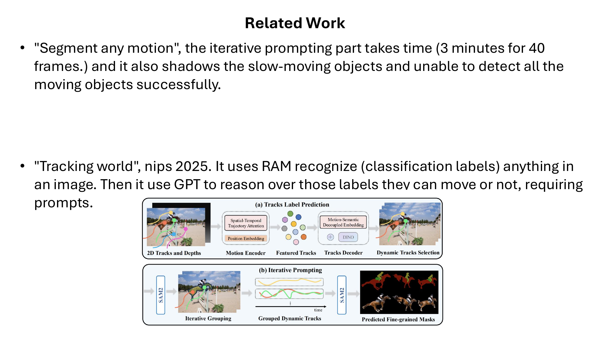
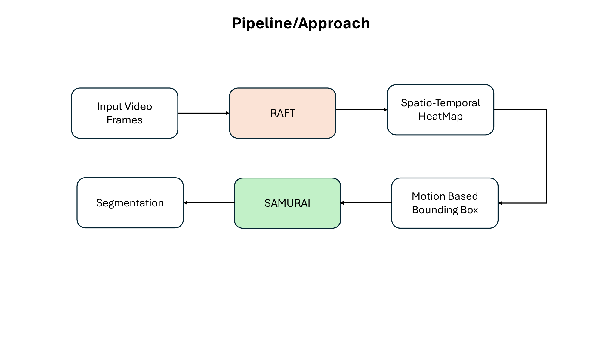
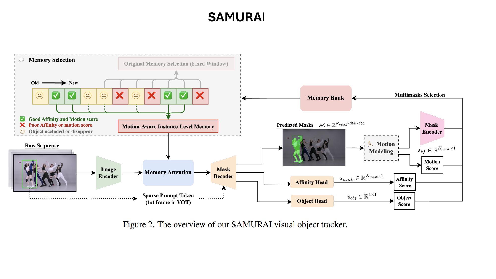
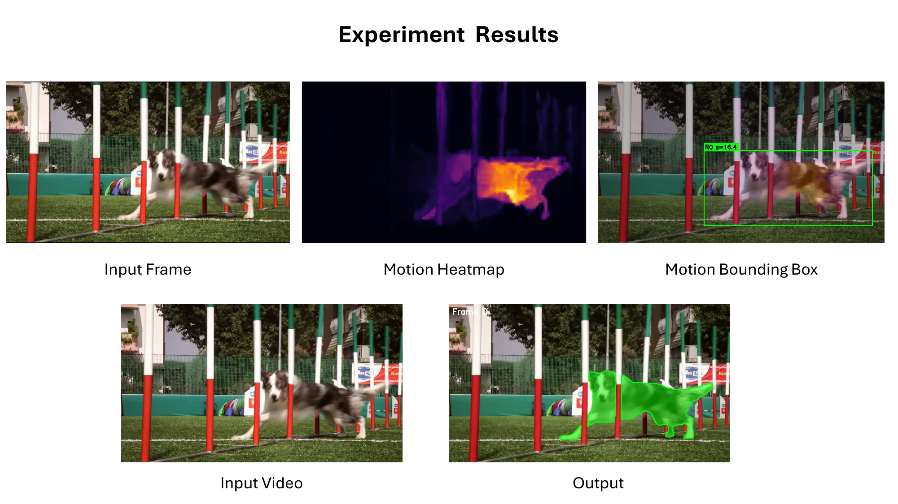
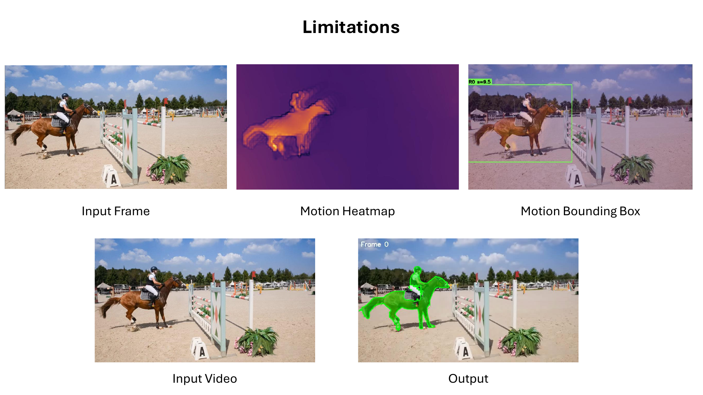
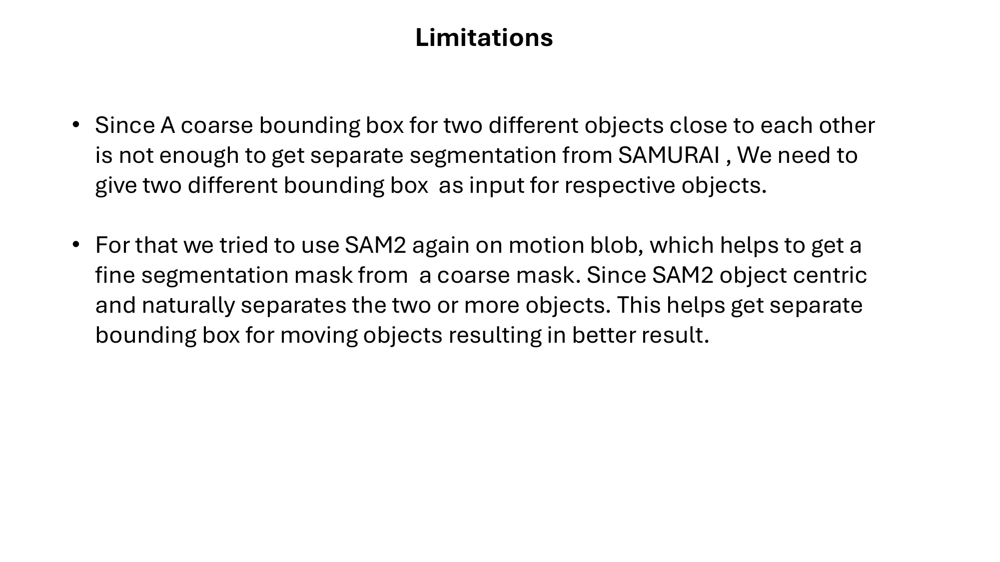
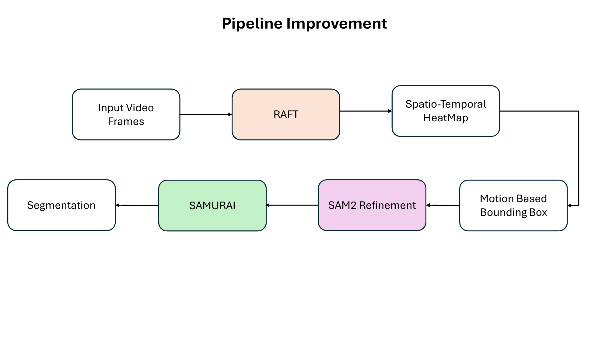
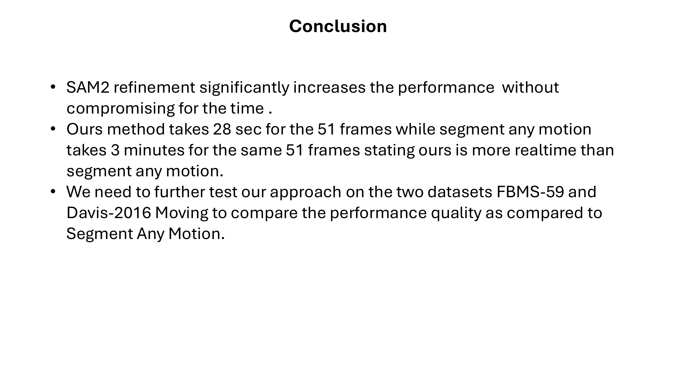

# Prompt-Free Moving Object Segmentation for Dynamic Scene Understanding

*A real-time pipeline that watches the pixels move, decides what's a "thing", and hands it to SAMURAI — all without a single human click.*

**Authors:** Omkar Mayekar, Yinhong Qin
**Course:** CPSC 6070 — Applied Computer Vision, Final Project

---

## TL;DR

Modern video segmentors like SAM 2 and SAMURAI are amazing — but they all wait for a human to draw a box or click a point. We removed the human. Our pipeline:

1. Computes dense optical flow with **RAFT**.
2. Accumulates flow over time into a **spatio-temporal motion heatmap**.
3. Pulls **bounding boxes** around moving regions automatically.
4. Refines those boxes with a quick **SAM 2 object-proposal pass** so that two objects moving together (think *horse + rider*) don't get fused into one blob.
5. Feeds the resulting boxes as implicit prompts to **SAMURAI**, which does the actual tracking and segmentation across the rest of the video.

End result: **51 frames in 28 seconds**, versus ~3 minutes for *Segment Any Motion*, while still scoring **J&F = 0.529** on SegTrackv2 and **~0.46** on a 6-sequence subset of FBMS-Testset.

> 
> *Slide 1 — Project title page.*

---

## 1. Why we built this

In any real video — surveillance, sports, autonomous driving, robotics — the most useful question is rarely *"what is in this frame?"* It is *"what is **moving**, and where is it going?"*.

The state-of-the-art interactive segmentor right now is **SAM 2** (and its tracking-aware variant **SAMURAI**). They produce gorgeous masks. But they need a prompt: a click, a stroke, or a bounding box. That's a hard requirement to satisfy in any automated system.

Our goal:

> **Build a fully prompt-free pipeline that, given just the raw video, finds every moving object and segments it in near real-time.**

The trick we chose: *let motion itself be the prompt.* If a region moves consistently across several frames, that region is almost certainly a "thing" — and its bounding box is exactly the kind of input SAMURAI was trained to consume.

> 
> *Slide 2 — Why we removed the human prompt.*

---

## 2. Related work, and what's wrong with it

Two recent papers tackle the same problem:

- **Segment Any Motion in Videos** (CVPR 2025) iteratively prompts SAM with motion cues. It works — but it's *slow* (~3 min for 40 frames in our hands) and tends to drop slow-moving and small objects.
- **TrackingWorld** (NeurIPS 2025) uses RAM to label every object then asks an LLM whether each label *can* move. It's powerful but expensive and still loops back through prompts.

Both leave a clean gap: a fast, geometry-first pipeline that decides "moving / not moving" *before* any heavy semantic model is invoked.

> 
> *Slide 3 — Why existing prompt-free pipelines are too slow or too prompt-heavy.*

---

## 3. The pipeline

The first version of our system has four stages:

```
Input frames → RAFT optical flow → Spatio-temporal heatmap → Motion bbox → SAMURAI → Segmentation
```

> 
> *Slide 4 — Original four-stage pipeline.*

### 3.1 RAFT optical flow (Pass 1)

We use **RAFT-Small** from `torchvision.models.optical_flow`. For every consecutive pair of frames it produces a 2-channel flow field whose magnitude `||(u, v)||` tells us how fast each pixel is moving.

Why RAFT? It's the gold standard for accuracy-vs-speed — small enough to batch on a single GPU, accurate enough that the downstream geometry doesn't have to fight noise.

### 3.2 From flow to a motion heatmap (Pass 2)

Single-frame flow is noisy. So we accumulate it:

1. **Camera-motion compensation.** A RANSAC affine fit on flow vectors estimates the dominant global motion and we subtract it. Real moving objects stay; pans, zooms and shakes get cancelled.
2. **Temporal accumulation.** We blend `N` consecutive flow magnitudes with an exponential decay (`α = 0.85`). The result is a heatmap where pixels that move *consistently* over several frames glow bright.
3. **Adaptive thresholding.** A percentile-based cut (75th percentile by default, with a `threshold_floor` for very low-motion scenes) turns the heatmap into a binary motion mask.
4. **Morphology.** Open → close to kill speckle and close pinholes.

### 3.3 Motion-based bounding boxes

We run connected-components on the cleaned mask, drop blobs smaller than `min_area`, and emit one bounding box per surviving blob. A small "hot-core" tightening step shrinks each box to where the motion energy is strongest, so the boxes look like prompts a human would draw.

> 
> *Slide 5 — Input frame → motion heatmap → motion-based bounding box → SAMURAI segmentation. Single-object case (rabbit) works out of the box.*

**Suggested figure files (already in the repo):**
- Heatmap: `motion_semantic_final/motion_heatmap.png`
- Motion mask: `motion_semantic_final/motion_mask.png`
- Bounding boxes overlaid: `motion_semantic_final/motion_bboxes.png`
- Final SAMURAI overlay video: `motion_semantic_final/segmentation_multi.mp4` *(extract a frame for the static blog)*

### 3.4 SAMURAI for tracking + segmentation (Pass 3)

For each motion box we instantiate **one** SAM 2 video predictor (memory-efficient — a single instance handles every object), seed it with the box on the first frame, and let it propagate. Because SAMURAI is already motion-aware (Kalman-style memory scoring inside SAM 2's memory bank), the masks stay locked to the object even when it accelerates or partially occludes.

Frames are dumped as JPEGs for SAM 2's video predictor and per-object masks are written to `obj_<i>/masks/`.

---

## 4. The first hard lesson: close-by objects fuse

The pipeline above works beautifully on isolated objects (rabbits, parachutes, cheetahs). But on the DAVIS *horsejump-high* clip we hit a wall:

> 
> *Slide 6 — Two close-moving objects share one motion blob, and the resulting single bounding box collapses both into one segmentation.*

The horse and rider move *together*. Optical-flow magnitude can't tell them apart — they form a single connected motion blob, get a single bounding box, and SAMURAI dutifully returns one combined mask. The DAVIS ground truth, however, expects them as two separate instances.

> 
> *Slide 7 — Why one coarse box for two objects is not enough for SAMURAI.*

---

## 5. Fix: a SAM 2 refinement pass

The fix is delightfully simple in hindsight. SAM 2 is *object-centric* — given a coarse motion blob, it naturally tends to propose **separate** masks for the distinct objects inside it.

So we added a **refinement stage** that runs SAM 2 on each motion blob, asks it for object proposals, and replaces the single coarse box with one box per high-quality proposal.

```
Input frames → RAFT → Heatmap → Motion bbox → SAM 2 refinement → SAMURAI → Segmentation
```

> 
> *Slide 8 — The five-stage pipeline with the SAM 2 refinement step bolted in.*

### 5.1 The NMS that finally worked

The first cut of the refinement gave us *three* boxes on horsejump-high: the horse, the rider, and the rider's **helmet**. Standard IoU-based NMS could not suppress the helmet because its bbox barely overlapped the rider's pixel-wise.

What worked is a **bbox-extension containment** rule. We sort proposals by area (largest first) and suppress any smaller mask whose bounding box extends beyond a kept larger one's bbox by at most `max_ext_px = 12` pixels on every side. That precisely catches "sub-parts" (helmet inside rider) without merging stacked but distinct objects (rider on top of horse).

> 
> *Slide 9 — Same scene after SAM 2 refinement. Two boxes, two masks, one happy DAVIS evaluator.*

**Suggested figure files (already in the repo):**
- Wrong (one fused box): `motion_semantic_final11/motion_bboxes.png` *(or any version that shows the merged result)*
- Right (two separated boxes): `motion_semantic_final/motion_bboxes.png`
- Combined SAMURAI overlay: `motion_semantic_final/segmentation_multi.mp4` (frame around frame 20 is a good still)

---

## 6. Numbers

We benchmarked on two standard moving-object datasets using SegAnyMo's `eval_mask.py` (Jaccard *J* and boundary *F*):

| Dataset | Sequences | J-Mean | F-Mean | **J&F-Mean** |
|---|---|---|---|---|
| **SegTrackv2** | 14 / 14 | 0.497 | 0.562 | **0.529** |
| **FBMS-Testset** | 6 / 30 (subset) | 0.423 | 0.488 | **0.455** |

Per-sequence highlights on SegTrackv2:

| Sequence | J | F |
|---|---|---|
| parachute | 0.92 | 0.99 |
| drift | 0.89 | 0.85 |
| bird_of_paradise | 0.90 | 0.89 |
| hummingbird | 0.83 | 0.87 |
| worm | 0.83 | 0.89 |
| monkey | 0.78 | 0.77 |
| girl | 0.49 | 0.72 |
| frog | 0.39 | 0.39 |
| birdfall | 0.00 | 0.00 |
| penguin | 0.02 | 0.11 |

Two sequences blow up to zero — *birdfall* (a tiny bird against a textureless sky, where RAFT-Small produces almost no usable flow) and *penguin* (no dominant motion). That's the price of being purely flow-driven; we discuss it in §7.

### Speed

For the same horsejump-high clip (51 frames at 854×480):

| Method | Wall time |
|---|---|
| Segment Any Motion (CVPR 2025) | ~180 s |
| **Ours** | **~28 s** (~6× faster) |

> 
> *Slide 11 — Headline conclusions.*

---

## 7. Limitations and honest failure modes

- **Tiny / textureless scenes.** RAFT-Small returns near-zero flow for objects like the birdfall finch on a smooth sky. The pipeline either drops them or latches onto noise.
- **Pure rotation or near-static motion.** If an object's flow vector is parallel to the camera's pan, RANSAC compensation cancels it.
- **Very long clips.** SAM 2's memory bank grows; we currently process windows of ~50 frames at a time.
- **Boundaries on furry/feathery objects.** F-score ceilings out around what SAM 2 itself can deliver.

Things we'd try next:
- Swap RAFT-Small for RAFT-Large or CRAFT for the static-camera scenes that need the extra accuracy.
- Use a tiny appearance encoder (DINOv2 / DINOv3 dense features) as a second clustering signal so that we can split objects by *both* motion and appearance.
- Online re-prompting when a SAMURAI track's confidence drops below threshold.

---

## 8. How to run it

The repo is here: **[github.com/&lt;your-username&gt;/motion-tracker](https://github.com/&lt;your-username&gt;/motion-tracker)**.

```bash
# Single video, full pipeline (split + segment)
python motion_semantic_segmenter.py \
    --video horsejump-high.mp4 \
    --output-dir motion_semantic_final \
    --split-method sam2 \
    --segment

# Whole-dataset evaluation
python evaluate_datasets.py \
    --datasets segtrackv2 fbms \
    --num-motion-frames 25 \
    --threshold-percentile 75 \
    --min-area 150 \
    --temporal-decay 0.85
```

Outputs land in `motion_semantic_final/`:
- `motion_heatmap.png` — accumulated flow magnitude.
- `motion_mask.png` — binary motion mask after thresholding + morphology.
- `motion_bboxes.png` — input frame with per-object bounding boxes.
- `obj_<i>/masks/` — per-frame binary masks (PNG).
- `obj_<i>/segmentation.mp4` — overlay video for object *i*.
- `segmentation_multi.mp4` — combined multi-object overlay.

---

## 9. Take-aways

1. **Optical flow is still the cheapest, most general "is-something-moving?" detector** — and a tiny amount of math (camera compensation + temporal decay) goes a long way.
2. **SAM 2 is almost as good as a click prompter on its own.** Used as a *post-hoc* refinement on a coarse motion blob, it solves the close-by-objects problem with no extra training.
3. **The bottleneck for prompt-free pipelines is no longer segmentation quality — it's deciding *what* to prompt.** If you can answer that automatically, modern foundation segmentors do the rest for free.

Code, configs and the SegTrackv2/FBMS evaluation harness are all in the repo. PRs welcome.

---

## References

- Huang, Nan, *et al.* **"Segment Any Motion in Videos."** *CVPR 2025.*
- Lu, Jiahao, *et al.* **"TrackingWorld: World-centric Monocular 3D Tracking of Almost All Pixels."** *arXiv:2512.08358*, 2025.
- Teed, Zachary, and Jia Deng. **"RAFT: Recurrent All-Pairs Field Transforms for Optical Flow."** *ECCV 2020.*
- Yang, Cheng-Yen, *et al.* **"SAMURAI: Adapting Segment Anything Model for Zero-Shot Visual Tracking with Motion-Aware Memory."** *arXiv:2411.11922*, 2024.
- Ravi, N., Gabeur, V., Hu, Y. T., *et al.* **"SAM 2: Segment Anything in Images and Videos."** *arXiv:2408.00714*, 2024.

---

## Appendix: image placement cheat-sheet for Medium

When you upload to Medium, replace the local Markdown image links with Medium-hosted images. Recommended order and source files:

| # | Caption | Source file |
|---|---|---|
| 1 | Title slide | `blog_images/slide-01.png` |
| 2 | Pipeline diagram (original) | `blog_images/slide-04.png` |
| 3 | Heatmap → bbox → output (rabbit) | `blog_images/slide-05.png` |
| 4 | Failure: horse+rider as one blob | `blog_images/slide-06.png` |
| 5 | Improved pipeline diagram | `blog_images/slide-08.png` |
| 6 | Improvement: split horse and rider | `blog_images/slide-09.png` |
| 7 | Conclusion / numbers | `blog_images/slide-11.png` |

You can also splice in your own qualitative frames:

- `motion_semantic_final/motion_heatmap.png` — the spatio-temporal heatmap.
- `motion_semantic_final/motion_bboxes.png` — bboxes on frame 0.
- `motion_semantic_final/segmentation_multi.mp4` — extract a frame around `t=1.5s` for a clean still.
- `eval_outputs/segtrackv2/initial_preds/<seq>/...` — predicted masks per dataset sequence (good for the "Numbers" section).
